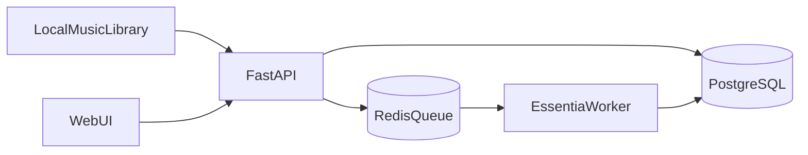

# Playlista Architecture

- `FastAPI` exposes ingest, analysis, and playlist endpoints.
- `Redis + RQ` executes asynchronous analysis jobs.
- `EssentiaWorker` extracts features and writes raw + normalized outputs.
- `PostgreSQL` stores tracks, jobs, features, playlists, and explanations.
